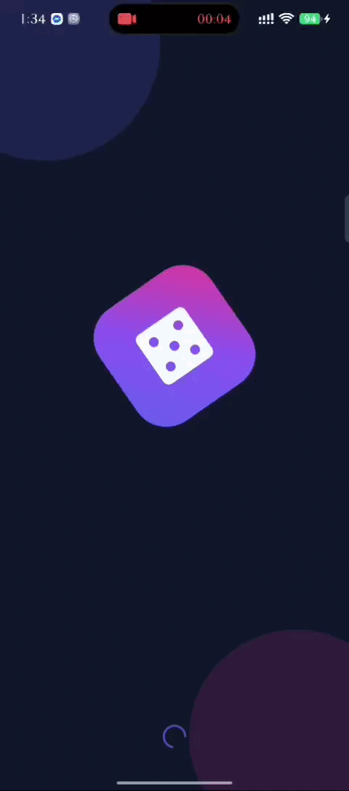
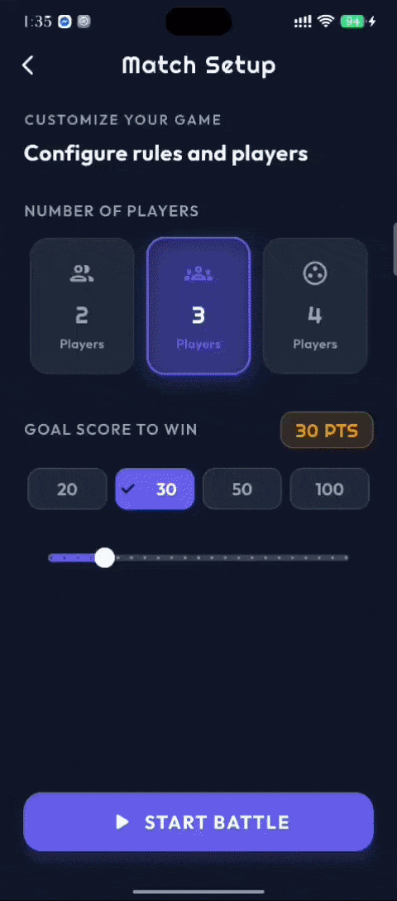
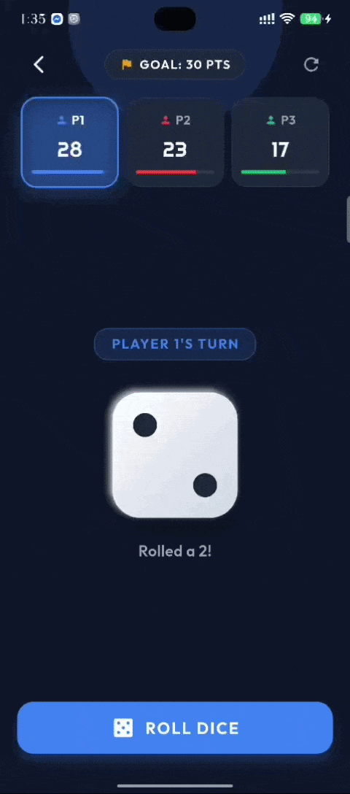
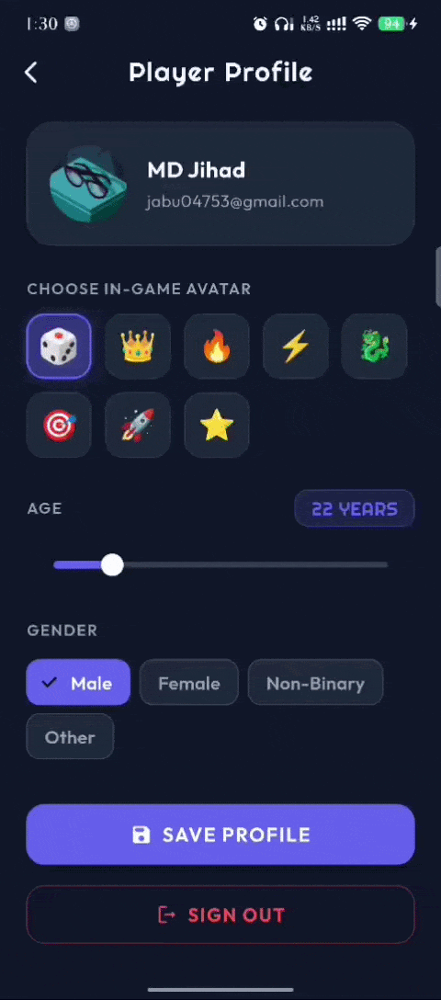

<div align="center">

# 🎲 ROLL MASTER
### *The Ultimate Animated Dice Battle Game*

<a href="https://git.io/typing-svg">
  
</a>

<br/>

[](https://flutter.dev)
[](https://dart.dev)
[](https://firebase.google.com)
[](https://developer.android.com)
[](LICENSE)

</div>

---

> 💡 **Roll Master** is an arcade-style, highly responsive Flutter dice game built with state-of-the-art UI/UX, buttery smooth procedural animations, dark-mode glassmorphism, and live multiplayer turn battles.

---

## ✨ About the Game

**Roll Master** reinvents the classic dice simulator into a high-stakes competitive party game. With procedural 3D perspective transforms, vibrant neon accents, tactile inner shadows, and dynamic scoreboards, every turn feels electric and rewarding.

Whether you're going head-to-head with friends on a single device or practicing against a simulated smart AI opponent, victory comes down to strategy, luck, and racing to the goal score before anyone else!

---

## 🚀 Key Features

- 🎮 **2 to 4 Local Multiplayer Mode**: Gather your crew! Play turn-by-turn on a single screen with real-time turn highlighting, signature player color themes, and dynamic progress trackers.
- 🤖 **Single Player vs Smart AI**: Face off against an intelligent automated bot featuring simulated decision pauses and automated turns.
- 🎯 **Custom Goal Score**: Fine-tune your match length! Pick quick presets (**20, 30, 50, 100 PTS**) or use the smooth custom slider to set any victory target from 10 to 120 points.
- 🎲 **Procedural 3D Animated Dice**: Zero heavy external 3D files needed! Procedurally animated dice featuring realistic perspective projection, bouncing scale curves, and tactile pip layout.
- 👤 **Google Sign-In & Profile Customization**: Authenticate seamlessly via `firebase_auth` & `google_sign_in`. Customize your in-game avatar (emojis), age, and gender preferences.
- 🎉 **Explosive Victory Celebrations**: Full-screen particle bursts powered by `confetti` and glassmorphic victory banners when a champion reaches the target score.
- ⚡ **Fluid Micro-Interactions**: Built using `flutter_animate` with staggered card entrances, ambient background glow, and breathing action buttons.

---

## 🛠 Tech Stack & Architecture

| Technology | Purpose |
| :--- | :--- |
| **[Flutter](https://flutter.dev)** | Cross-platform UI toolkit targeting Android and iOS |
| **[Provider](https://pub.dev/packages/provider)** | Reactive state management for turns, scores, AI logic, and auth |
| **[flutter_animate](https://pub.dev/packages/flutter_animate)** | Micro-animations, staggered entrances, and pulsing primary buttons |
| **[Lottie](https://pub.dev/packages/lottie)** | Vector animations for splash screens |
| **[Confetti](https://pub.dev/packages/confetti)** | Physics-driven celebratory particle explosions for match victories |
| **[Google Fonts](https://pub.dev/packages/google_fonts)** | Premium typography with *Righteous* for headers and *Outfit* for body |
| **[Firebase Auth](https://pub.dev/packages/firebase_auth)** | Secure authentication with Google credential exchange |
| **[Google Sign-In](https://pub.dev/packages/google_sign_in)** | Native Google OAuth client flow |

---

## 📸 Gallery

| 🌟 Procedural Splash & Menu | 🎲 Live Game Board & 3D Roll |
| :---: | :---: |
|  |  |
| *Staggered button entrances & continuous pulse* | *Procedural 3D perspective spin & turn indicator* |

<br/>

| 🏆 Confetti Victory Celebration | 👤 Google Profile & Customizer |
| :---: | :---: |
|  |  |
| *Confetti explosion & champion modal* | *Google avatar, custom age slider & gender chips* |

---

## ⚙️ Getting Started / Installation

Follow these steps to run the project locally on your machine or emulator:

### Prerequisites
- [Flutter SDK](https://docs.flutter.dev/get-started/install) (Version `^3.12.0` or higher)
- [Android Studio](https://developer.android.com/studio) or VS Code with Flutter extension
- An Android Emulator or physical Android device with USB Debugging enabled

### 1. Clone the Repository
```bash
git clone https://github.com/AZtheE1/Dice-rolling-Android-App.git
cd Dice-rolling-Android-App
```

### 2. Install Dependencies
```bash
flutter pub get
```

### 3. Configure Firebase (Google Sign-In)
1. Head over to the [Firebase Console](https://console.firebase.google.com/) and create a new project.
2. Add an **Android App** using your package name: `com.example.dicerollinggame`.
3. Add your SHA-1 fingerprint (run `.\gradlew signingReport` inside the `android/` directory).
4. Download the `google-services.json` file and place it in:
   ```
   android/app/google-services.json
   ```

### 4. Run the Game
```bash
flutter run
```

---

## 📂 Project Structure

```
lib/
├── core/
│   └── theme/
│       └── app_colors.dart         # Theme palette, dark surfaces & player colors
├── providers/
│   ├── game_provider.dart          # Turn logic, scores, win condition & AI bot
│   └── auth_provider.dart          # Firebase auth & in-game profile state
├── screens/
│   ├── splash_screen.dart          # Procedural animated splash sequence
│   ├── home_screen.dart            # Main dashboard with staggered animated cards
│   ├── setup_screen.dart           # 2-4 player selection & goal score setup
│   ├── single_player_setup.dart    # 1 vs AI bot match configuration
│   ├── game_board_screen.dart      # Interactive dice rolling board & confetti win
│   └── profile_screen.dart         # Google Sign-In & custom avatar preferences
├── widgets/
│   └── dice/
│       └── procedural_dice.dart    # 3D matrix-transformed procedural dice widget
└── main.dart                       # App initialization & MultiProvider binding
```

---

## 🤝 Contributing

Contributions, issues, and feature requests are welcome! Feel free to check the [issues page](https://github.com/AZtheE1/Dice-rolling-Android-App/issues).

1. Fork the Project
2. Create your Feature Branch (`git checkout -b feature/EpicFeature`)
3. Commit your Changes (`git commit -m 'feat: add some epic feature'`)
4. Push to the Branch (`git push origin feature/EpicFeature`)
5. Open a Pull Request

---

<div align="center">

Developed with ❤️ using Flutter & Dart.

⭐ **Star this repository if you enjoyed rolling the dice!** ⭐

</div>
